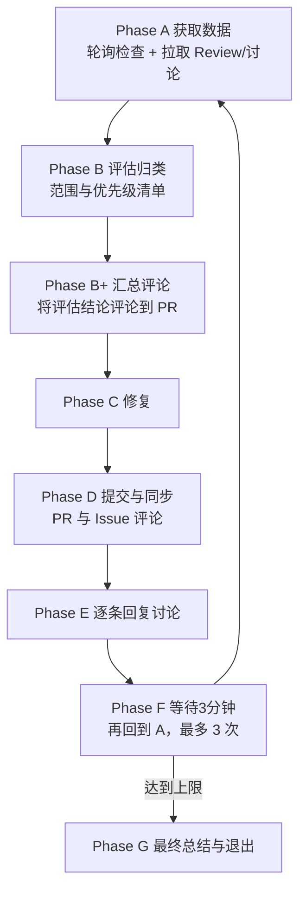

# PR Fix Pilot

输入参数

- PR 标识：$ARGUMENTS
- 若为空，请先询问用户补充：请提供 PR 编号或 URL。

目标

- 对指定 PR 做最小破坏的修复收敛：获取状态 → 归类问题 → 产出最小修复计划 → 如涉及后端，遵循增量预检与 E2E 约束 -> 按照流程提交代码-> 回复所有讨论-> 回复PR“最终汇总和结论”->给出后续建议

参数解析约定

- 将 `$ARGUMENTS` 解析为 PR 标识；若包含 `--issue <ID>`，提取为 Issue ID；否则在输出中用 `<issue-id>` 占位并提示用户替换。

1. 分类与清洗

- 分类标签：
  - 阻断问题（Blocking）：必须修复才能合并；通常来自 Request Changes、编译/测试失败、安全问题、严重逻辑错误。
  - 高收益非阻断（High ROI, Non-blocking）：改动小、风险低、收益明显的改进项。
  - 一般优化（Nice-to-have）：可优化但非当下必须，或投入产出一般。
  - 已拒绝/争议项（Rejected/Contested）：已说明“不同意/不采纳/无效”的内容，或存在明显误解。
- 清洗规则：
  - 去除已解决/已标记 resolved 的线程。
  - 合并重复与等价建议（同一文件与行、同义建议、相同症结）。
  - 过滤与当前 PR 范围无关或已偏离版本边界的建议。

2. 投入与收益估算（每项）

- 指标建议：
  - 实现复杂度（1-5）
  - 风险与回归成本（1-5）
  - 变更面大小（1-5）
  - 用户/业务价值（1-5）
- 计算建议：
  - 设“工作量”= 复杂度 + 变更面（或加入风险权重）
  - 设“收益值”= 用户价值 - 风险（或加入稳定性权重）
  - 用简单矩阵排序：优先“低成本高收益”。

- 每条建议包含：变更点列表、影响面、风险点与测试建议、预估工作量/风险分、预期收益。

3. 修复范围决策（含取舍理由）

- 必选：全部阻断问题（前提是判断正确且不与其他规则冲突）。
- 可选：纳入“高收益且低风险/低成本”的非阻断项（需要给出纳入理由）。
- 拒绝（含延后）：对中低收益或高风险项，记录为拒绝并说明理由与后续安排（将在 PR 评论中同步）。

4. 产出清单

- 生成“修复范围与优先级清单”，字段建议：
  - 分类（Blocking/High ROI/Nice-to-have/Rejected）
  - 摘要与定位（文件/行/上下文）
  - 预估工作量与风险说明
  - 预期收益与影响面
  - 取舍结论与理由

---

## Execution Flow Summary

---

---

## Success Criteria

- 阻断问题均已修复或获得明确、充分的拒绝理由并经沟通达成一致；
- 高收益非阻断项在可控成本内纳入；
- CI/自动检查通过或已按流程豁免；
- PR 与关联 Issue 均获得清晰、可追溯的记录与链接；
- 最终总结完整，便于合并决策与后续追踪。

---

## Important Notes

- 对于discussion 必须在对应位置逐项回复，不管是拒绝还是接受
- 遵循“最小可合并单元”原则，避免范围膨胀；
- Commit 粒度与信息需清晰、可审计；
- 对“拒绝（含延后）”类项务必写明充分理由并在 PR 同步；
